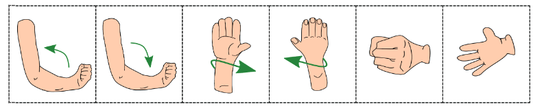

<div id="back-to-top"> </div>

# Abstract
**Objective** : To classify EEG signals into 7 classes (6 movement classes + rest class) using deep learning models.

**Classification Paradigm** : 
- _mov vs mov_ : Multiclass classification of 6 movement classes vs rest
- _mov vs rest_ : Binary classification of 6 movement classes vs rest

# **Dataset**

- Dataset can be downloaded from http://bnci-horizon-2020.eu/database/data-sets [25].

```
Dataset description :

```


<center>Fig 1 : Six movement classes shown</center>


<div align="right">&#8673; <a href="#back-to-top">Back to Top</a></div>


# References
[1] Ofner, P., Schwarz, A., Pereira, J., & Müller-Putz, G. R. (2017). Upper limb movements can be decoded from the time-domain of low-frequency EEG. PloS one, 12(8), e0182578.  
[2] van Noord, K., Wang, W., & Jiao, H. (2021, November). Insights of 3d input cnn in eeg-based emotion recognition. In 2021 43rd Annual International Conference of the IEEE Engineering in Medicine & Biology Society (EMBC) (pp. 212-215). IEEE.
<div align="right">&#8673; <a href="#back-to-top">Back to Top</a></div>